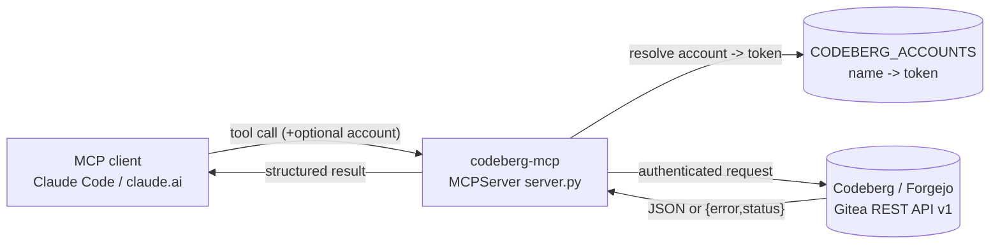

# codeberg-mcp

[](https://github.com/effecet/codeberg-mcp/actions/workflows/ci.yml)
[](LICENSE)
[](https://www.python.org/)
[](https://modelcontextprotocol.io/)
[](https://codeberg.org)

An [MCP](https://modelcontextprotocol.io/) server for **Codeberg** (and any
Gitea/Forgejo instance) exposing **49 tools** for repos, files, pull requests,
branches, commits, issues, releases, tags, Actions, and repo/account settings —
with **multi-account** support and a consistent structured error contract.

Works with **Claude Code** (stdio transport) and **claude.ai custom connectors**
(streamable-HTTP / SSE transport).

## Why

The official tooling around Forgejo/Gitea is thin, and switching between several
accounts (e.g. a personal account and an org) usually means juggling tokens by
hand. This server wraps the REST API behind typed MCP tools, routes each call to
the right account via a single `account` parameter, and turns API failures into
a predictable `{"error": ..., "status": ...}` shape so the agent can reason about
them instead of crashing.

## Architecture



## Install

```bash
git clone https://github.com/effecet/codeberg-mcp.git
cd codeberg-mcp
python3 -m venv .venv && source .venv/bin/activate
pip install -r requirements.txt
cp .env.example .env        # then edit .env (see Configuration)
```

## Configuration

All config is via environment variables (loaded from `.env`):

| Variable | Required | Description |
|---|---|---|
| `CODEBERG_ACCOUNTS` | yes | JSON `{name: token}` map. Generate tokens at `https://codeberg.org/user/settings/applications`. |
| `CODEBERG_DEFAULT_ACCOUNT` | no | Account used when a tool omits `account`. Defaults to the first key. |
| `MCP_TRANSPORT` | no | `stdio` \| `http` (default) \| `sse`. |
| `HOST` / `PORT` | no | Bind address for `http`/`sse` (default `0.0.0.0:8000`). |

Token scopes depend on which tools you use: `read/write:repository`,
`read/write:issue`, `read:user`. A token missing a scope returns a clean `403`
through the error contract rather than crashing.

## Usage

### Claude Code (stdio)

Add to your MCP config (e.g. `~/.claude/.mcp.json`):

```json
{
  "mcpServers": {
    "codeberg": {
      "command": "python",
      "args": ["/path/to/codeberg-mcp/server.py"],
      "env": { "MCP_TRANSPORT": "stdio" }
    }
  }
}
```

(`CODEBERG_ACCOUNTS` can live in the repo's `.env` or be passed in `env`.)

### claude.ai custom connector (HTTP)

```bash
MCP_TRANSPORT=http PORT=8000 python server.py
# exposes streamable-HTTP on http://0.0.0.0:8000
```

## Tools (49)

| Group | Tools |
|---|---|
| Repos | `list_repos`, `get_repo`, `create_repo`, `edit_repo`, `set_repo_actions_enabled` |
| Files | `get_file`, `create_file`, `update_file`, `delete_file`, `list_dir` |
| Pull requests | `list_pulls`, `get_pull`, `create_pull`, `merge_pull`, `list_pull_files`, `list_pull_commits`, `list_pull_reviews` |
| Branches / commits | `list_branches`, `create_branch`, `get_latest_commit`, `compare_refs` |
| Issues | `list_issues`, `get_issue`, `create_issue`, `edit_issue`, `comment_on_issue`, `list_issue_labels`, `add_issue_labels`, `remove_issue_label` |
| Releases / tags | `list_releases`, `get_release`, `get_release_by_tag`, `create_release`, `edit_release`, `list_tags`, `get_tag` |
| Actions | `list_workflow_runs`, `get_workflow_run`, `get_workflow_logs`, `list_actions_variables`, `get_actions_variable`, `create_actions_variable`, `update_actions_variable` |
| Account / secrets | `list_user_keys`, `list_user_emails`, `list_repo_secrets` |

Every tool accepts an optional `account` parameter to pick which configured
account (token) to use.

## Error contract

On any API failure a tool returns, instead of its normal result:

```json
{"error": "Codeberg API <status>: <detail>", "status": <int|null>}
```

Treat any result with top-level `error` and `status` keys as a failure. Tools
that normally return a list or text (or nothing) cannot return that object, so
they report an error result (`isError: true`) whose text is
`Error executing tool <name>: ` followed by the same JSON.

Caller mistakes the caller can fix (unknown account, a directory passed to
`get_file`, an invalid merge method) come back as an error result with the
guidance as text. Any other failure inside a tool is a bug, and the client sees
only `Error executing tool <name>`.

If Codeberg cannot be reached at all (timeout, refused or dropped connection),
`status` is `null` and `error` names the transport failure. There was no HTTP
answer, so a write may still have landed: check state before retrying.

## Development

```bash
pip install -r requirements.txt
pytest -q          # 130 tests (respx-mocked, no network)
ruff check .
ruff format --check .
```

CI runs ruff + pytest on GitHub Actions (`.github/workflows/ci.yml`).

## License

MIT — see [LICENSE](LICENSE). crafted by effece 🧉
